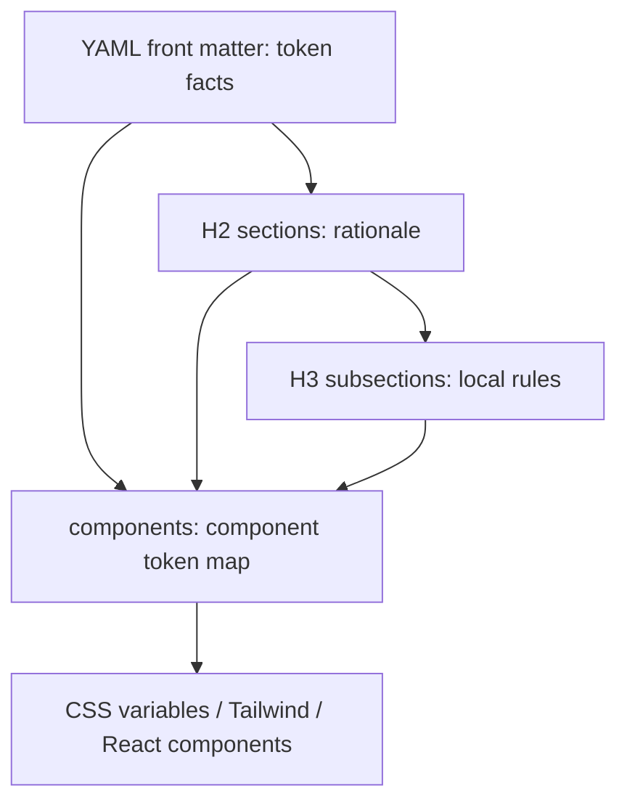
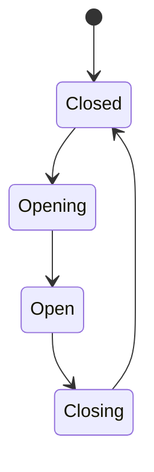
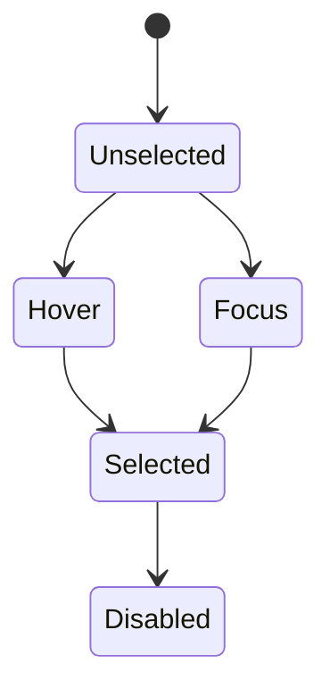
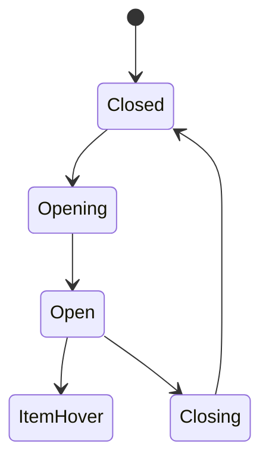
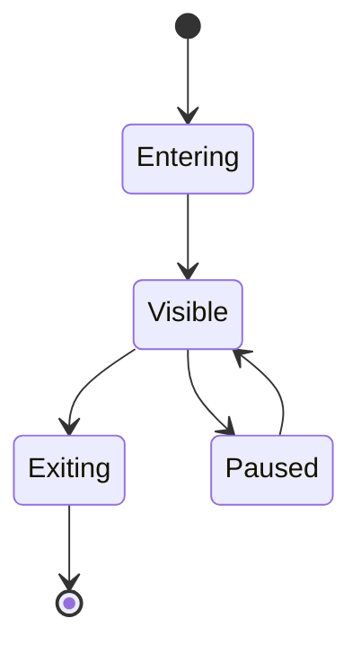
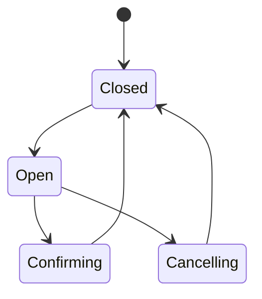

# DESIGN.md 设计系统结构契约深拆

采集对象：`../official/google-design-md/`

本文按 8 层框架拆解 Google Labs Code `design.md` 官方规范与官方 examples。需要先明确边界：官方 `spec.md` 目前正式定义的顶层 token 是 `colors`、`typography`、`rounded`、`spacing`、`components`；`border`、`shadow`、`motion`、`opacity`、`z-index` 在官方 examples 中有体现或被 prose 提到，但不是当前官方 schema 的一等顶层 token。本文会把两类内容分开标注：

- **官方契约**：`spec.md` 明确要求或 examples 稳定出现的结构。
- **工程扩展契约**：官方没有完整定义，但一个可维护设计系统必须继续补齐的结构。

## 第一层：结构拆解

### 1.1 标题层级为什么存在

| 标题层级 | 官方地位 | 解决什么问题 | 如果删掉会发生什么 | 与其他章节的依赖关系 |
| --- | --- | --- | --- | --- |
| YAML front matter | 官方契约 | 给机器、CLI、agent、导出器提供结构化 token | 人还能读，但工具失去精确值，只能凭 prose 猜样式 | 被 Markdown body 解释；被 `design_tokens.json`、Tailwind、组件实现消费 |
| H1 `#` | 可选，不作为 section 解析 | 给人类读者提供文档身份和阅读入口 | 不影响机器解析，但降低文档可扫读性 | 依赖 `name`，不应和 `name` 表达冲突 |
| H2 `##` | 官方 section 单位 | 把设计系统拆成稳定语义域：品牌、颜色、排版、布局、深度、形状、组件、禁忌 | agent 仍能读 token，但失去“为什么这样用”的上下文 | 每个 H2 解释对应 token 或补足 token 无法表达的规则 |
| H3 `###` | prose 内部结构 | 在组件等复杂章节里继续拆子域，例如按钮、卡片、输入、导航 | 复杂组件规则会堆成一团，agent 很难定位局部规则 | 通常依赖 `## Components`，也可服务 `Elevation`、`Typography` 等章节 |

### 1.2 章节结构契约

| 章节名称 | 目的 | 输入 | 输出 | 依赖项 | 设计原因 |
| --- | --- | --- | --- | --- | --- |
| YAML front matter | 保存机器可读 token | 品牌视觉决策、Figma 变量、已有 CSS 变量、组件样式 | 可解析 token map | 所有正文解释和工程导出 | 让 agent 不用猜颜色、字号、间距、圆角；让工具可 lint、diff、export |
| `name` | 标识设计系统 | 产品名、品牌名、子系统名 | 设计系统名称 | H1、README、导出包 | 多品牌、多子应用时必须知道当前 token 属于哪个系统 |
| `description` | 简短定义设计定位 | 产品定位、受众、风格关键词 | 一句话范围说明 | `Overview` | 让工具和 agent 在读取完整 prose 前先知道目标风格 |
| `colors` | 定义颜色 token | 品牌色、语义色、表面色、文字色、状态色 | 可引用的颜色值 | `Colors`、`components`、contrast 检查 | 颜色是最容易被 agent 写乱的视觉资产，必须 token 化 |
| `typography` | 定义字体层级 | 字体族、字号、字重、行高、字距 | 文本层级 token | `Typography`、`components` | 排版影响可读性、信息层级和品牌语气，不能散落写死 |
| `rounded` | 定义圆角尺度 | 形状语言、组件尺寸、品牌气质 | radius scale | `Shapes`、`components` | 圆角决定 UI 性格；统一尺度避免按钮圆、卡片方的混乱 |
| `spacing` | 定义间距尺度 | 栅格、密度、容器宽度、内外边距 | spacing scale | `Layout`、`components` | 间距决定节奏和密度；没有 scale 就会出现随机 `13px/17px/22px` |
| `components` | 定义组件级 token | 基础 token、组件变体、状态值 | component token map | `colors`、`typography`、`rounded`、`spacing` | 组件是设计系统落地到代码的最后一层，必须把抽象 token 绑定到具体 UI |
| `## Overview` / `Brand & Style` | 说明整体风格和用户感受 | 品牌策略、受众、产品场景 | 高层风格判断依据 | 所有章节 | 当 token 没覆盖具体情况时，agent 需要这个章节判断风格方向 |
| `## Colors` | 解释颜色用途 | `colors` token、品牌语义、状态语义 | 颜色使用规则 | `colors`、组件状态 | 同一个色值在不同上下文含义不同，需要说明“什么时候用” |
| `## Typography` | 解释文字体系 | `typography` token、内容层级 | 文本角色和使用边界 | `typography`、组件内容 | 字号不是越大越好，需要用角色控制信息层级 |
| `## Layout` / `Layout & Spacing` | 解释布局模型 | `spacing` token、网格、断点、密度 | 页面结构和节奏规则 | `spacing`、组件容器 | 页面不是组件堆叠；需要约束网格、留白、容器宽度 |
| `## Elevation & Depth` | 解释层级和深度 | shadow、border、surface、blur、透明度 | 视觉层级规则 | `colors`、组件容器 | 当前官方没有顶层 `shadow` token，所以 prose 更关键 |
| `## Shapes` | 解释形状语言 | `rounded` token、图标线帽、卡片形状 | 圆角使用规则 | `rounded`、组件 | 同一套 radius 在不同组件上要有语义，否则只有数值没有理由 |
| `## Components` | 解释组件组合方式 | `components` token、交互状态、组件类型 | 组件级规范 | 所有基础 token | 工程实现最终落在组件；这里把 token 翻译成 UI 使用规则 |
| `## Do's and Don'ts` | 给 agent guardrail | 常见错误、品牌禁忌、可访问性要求 | 操作边界 | 所有章节 | AI 最容易“补一点自以为合理的样式”，禁忌章节用于阻止漂移 |

### 1.3 一级、二级、三级标题的依赖图



结构原则：一级身份用于定位，二级章节用于划分设计语义域，三级章节用于拆复杂组件或复杂机制。机器以 YAML 为主，agent 以 YAML + prose 一起决策。

## 第二层：设计系统思想拆解

### 2.1 为什么需要 Design Token

| 角度 | 原因 |
| --- | --- |
| 工程原因 | token 把视觉决策变成可引用、可导出、可校验的数据，而不是散落在 CSS、JSX、Figma、截图里的重复值。 |
| 设计原因 | token 让颜色、字号、间距、圆角背后有统一语言，例如 `primary` 是行动色，不只是某个 HEX。 |
| 维护原因 | 改品牌色时改 token 即可影响所有引用点，避免全仓搜索替换。 |
| 扩展原因 | 支持暗色模式、多品牌、主题切换、平台差异时，只替换映射层，不重写组件。 |

如果没有 token：每个页面都会自行定义颜色和间距；agent 会根据局部截图补样式；设计系统会变成“看起来差不多”的复制粘贴。

### 2.2 为什么不能写死颜色

写死颜色的问题不是“颜色不好看”，而是它切断了语义。

```css
/* 问题：不知道这个颜色承担什么角色 */
color: #855300;

/* 更好：知道这是主要行动色 */
color: var(--color-primary);
```

| 角度 | 原因 |
| --- | --- |
| 工程原因 | 写死颜色无法批量迁移主题，无法知道哪些值属于同一语义角色。 |
| 设计原因 | 同一个 HEX 可能在一个品牌里是主色，在另一个品牌里是警告色。 |
| 维护原因 | 搜索 `#855300` 无法判断替换会不会破坏 badge、button、link、chart。 |
| 扩展原因 | 暗色模式、多品牌、白标项目都需要把“值”和“角色”分开。 |

### 2.3 为什么不能写死字体大小

字体大小决定信息层级，不只是视觉数值。

| 角度 | 原因 |
| --- | --- |
| 工程原因 | 写死 `16px/18px/24px` 会导致响应式、无障碍缩放、跨端适配失控。 |
| 设计原因 | `body-md`、`label-sm`、`headline-lg` 表示内容角色，而不是孤立字号。 |
| 维护原因 | 字体换代或密度调整时，需要调整一组层级，不应该逐文件替换。 |
| 扩展原因 | 国际化、长文本、移动端、大屏端都需要基于 typography scale 做映射。 |

### 2.4 为什么不能写死圆角

圆角是品牌形状语言。`4px`、`12px`、`9999px` 背后分别代表技术感、友好感、胶囊操作。

| 角度 | 原因 |
| --- | --- |
| 工程原因 | 写死 radius 会让组件之间形状不一致，难以建立组件约束。 |
| 设计原因 | 圆角影响信任感、活泼度、专业度和触摸感。 |
| 维护原因 | 一次品牌调整会牵动按钮、卡片、输入框、弹窗、菜单。 |
| 扩展原因 | 多品牌可能需要一套组件结构配不同 shape scale。 |

### 2.5 为什么不能直接使用 HEX Color

官方规范允许 HEX，并推荐它作为简单、兼容的默认格式；但工程上不应该在业务代码直接使用 HEX。区别是：

- `DESIGN.md` token 里可以保存 HEX。
- 业务组件里应该引用 token，不直接写 HEX。

| 层 | 可以直接 HEX 吗 | 原因 |
| --- | --- | --- |
| Primitive token | 可以 | 这里保存原始事实值。 |
| Alias / semantic token | 不推荐裸值扩散 | 应通过引用表达角色和映射。 |
| Component / CSS / JSX | 不应该 | 会绕过主题、暗色模式、contrast 检查和品牌切换。 |

### 2.6 为什么需要 Primitive Token

Primitive token 是原始材料层，例如 `blue-500`、`neutral-0`、`space-4`、`radius-2`。

| 角度 | 原因 |
| --- | --- |
| 工程原因 | 提供稳定底层值，供 alias 和 semantic 引用。 |
| 设计原因 | 保留色阶、尺寸阶梯、字体阶梯的完整系统。 |
| 维护原因 | 调整色阶或 spacing scale 时有唯一入口。 |
| 扩展原因 | 多品牌可以复用结构，替换 primitive 值。 |

### 2.7 为什么需要 Alias Token

Alias token 是把 primitive 包成可读名称，例如 `brand-primary`、`brand-accent`、`font-sans`。

| 角度 | 原因 |
| --- | --- |
| 工程原因 | 避免直接让业务层依赖 `blue-500` 这类原料名。 |
| 设计原因 | 表达品牌资产，而不是孤立色阶。 |
| 维护原因 | 品牌主色从蓝变紫时，业务层不需要知道 primitive 变化。 |
| 扩展原因 | 支持多个产品线共享一套语义角色但拥有不同品牌 alias。 |

### 2.8 为什么需要 Semantic Token

Semantic token 是角色层，例如 `surface`、`on-surface`、`primary`、`on-primary`、`error`。

| 角度 | 原因 |
| --- | --- |
| 工程原因 | 组件只关心角色，不关心具体颜色。 |
| 设计原因 | 确保背景和文字成对出现，例如 `primary` 必须配 `on-primary`。 |
| 维护原因 | 暗色模式只替换语义映射，组件不需要重写。 |
| 扩展原因 | 主题切换、多品牌、状态色、可访问性都建立在 semantic 层。 |

### 2.9 为什么需要 Component Token

Component token 是最终落地层，例如 `button-primary.backgroundColor`、`input-field.rounded`。

| 角度 | 原因 |
| --- | --- |
| 工程原因 | 组件实现只消费自己的 token，避免每个组件重新组合基础 token。 |
| 设计原因 | 同一语义色在不同组件里可能要不同透明度、边框、状态。 |
| 维护原因 | 按组件局部调整，不影响全局 token。 |
| 扩展原因 | 支持组件状态、尺寸、变体、平台差异。 |

## 第三层：Token 体系拆解

### 3.1 官方已识别 token

| Token 类型 | 官方状态 | examples 中是否出现 | 说明 |
| --- | --- | --- | --- |
| Color Token | 官方顶层 token | 是 | `colors.primary`、`colors.surface`、`colors.on-surface` 等 |
| Typography Token | 官方顶层 token | 是 | `typography.body-md`、`typography.label-md` 等 |
| Spacing Token | 官方顶层 token | 是 | `spacing.unit`、`spacing.gutter`、`spacing.md` 等 |
| Radius Token | 官方顶层 token，名称为 `rounded` | 是 | `rounded.sm`、`rounded.lg`、`rounded.full` |
| Component Token | 官方顶层 token | 是 | `button-primary.backgroundColor`、`input-field.typography` 等 |
| Border Token | 非官方顶层 | prose 和 component property 可表达 | spec 提到 unknown component property 会 warning；examples 在 prose 写 border |
| Shadow Token | 非官方顶层 | prose 中出现 | `Elevation & Depth` 解释 shadow，但 YAML 无顶层 `shadow` |
| Motion Token | 非官方顶层 | prose 中出现 | Paws example 提到 `150ms ease-in-out`，但无顶层 `motion` |
| Opacity Token | 非官方顶层 | 嵌在 color 值里 | examples 使用 `rgba(...)`，但未抽象为 opacity scale |
| Z-index Token | 非官方顶层 | 未出现 | 当前官方快照未定义层级堆叠 token |

### 3.2 Token 层级图

```text
Primitive Token
  原始色值、尺寸、字体、透明度、阴影参数
  例：neutral-0 = #ffffff, space-4 = 16px
        ↓
Alias Token
  品牌别名和系统别名
  例：brand-primary = neutral-0, font-display = Space Grotesk
        ↓
Semantic Token
  UI 角色
  例：surface, on-surface, primary, on-primary, error
        ↓
Component Token
  组件、变体、状态的最终引用
  例：button-primary.backgroundColor = {colors.primary}
```

### 3.3 为什么这样分层

| 层级 | 解决的问题 | 如果不分层会发生什么 |
| --- | --- | --- |
| Primitive | 保存最底层材料 | 设计系统没有完整色阶和尺寸阶梯，后续扩展只能临时补值 |
| Alias | 隔离品牌资产和原始材料 | 品牌换色会直接冲击语义层和组件层 |
| Semantic | 表达 UI 角色和可访问性配对 | 组件不知道自己用的是背景、文字、边框还是状态色 |
| Component | 绑定到真实组件和状态 | 每个组件都重新组合基础 token，导致 button/card/input 行为不一致 |

### 3.4 对当前官方 schema 的扩展建议

当前官方 schema 足够表达基础视觉系统，但如果要进入严肃生产设计系统，建议扩展这些顶层 token：

```yaml
borders:
  default:
    width: 1px
    style: solid
    color: "{colors.outline}"
shadows:
  card:
    value: "0 8px 32px rgba(0, 0, 0, 0.08)"
motion:
  fast:
    duration: 150ms
    easing: ease-in-out
opacity:
  disabled: 0.38
zIndex:
  dropdown: 1000
  modal: 1300
```

这些不是当前官方 examples 的正式字段；如果加入业务项目，需要在 `DESIGN.md` 的 `Do's and Don'ts` 和 Cursor/Codex 规则里说明“本项目扩展字段是内部契约”。

## 第四层：Dark Mode 拆解

### 4.1 当前官方快照怎么处理 Dark Mode

官方 examples 展示了暗色风格和浅色风格，但不是同一套 token 的 light/dark 双模式配置：

- `atmospheric-glass`：偏暗色玻璃拟态。
- `totality-festival`：偏暗色宇宙高对比。
- `paws-and-paths`：偏浅色服务类应用。

结论：当前官方规范证明 DESIGN.md 可以表达暗色系统，但没有正式定义 `modes.light` / `modes.dark` 这种多模式 schema。

### 4.2 Dark Mode 不只是颜色变化

Dark Mode 至少影响三层：

| 层 | 是否应该变化 | 说明 |
| --- | --- | --- |
| Primitive Token | 通常不变或只扩充 | 原始色阶可以同时包含 light/dark 可用材料，例如 neutral-0 到 neutral-1000 |
| Alias Token | 可能变化 | 品牌 alias 在不同模式下可指向不同 primitive，以保持品牌感和对比度 |
| Semantic Token | 必须变化 | `surface`、`on-surface`、`primary`、`outline` 等角色要按模式重新映射 |
| Component Token | 尽量不变 | 组件应引用 semantic token；只有特殊组件需要模式变体 |

### 4.3 为什么不能直接把白色变黑色

直接反转的问题：

1. 对比度不可靠：白底黑字直接反转为黑底白字，可能让 secondary text、outline、disabled 状态过亮。
2. 层级会崩：浅色模式靠阴影区分层级，暗色模式通常靠 surface tone、outline、glow、alpha。
3. 品牌会变味：主色在暗色背景上需要重新调亮度、饱和度和对比。
4. 透明度会失控：`rgba(255,255,255,0.1)` 和 `rgba(0,0,0,0.1)` 不是对称效果。
5. 图片、图表、状态色需要单独处理：错误红、成功绿、警告黄在暗色下需要重新校验。

### 4.4 为什么 Dark Mode 应该建立在 Semantic Token 上

组件不应该知道现在是 light 还是 dark。组件只应该写：

```css
.card {
  background: var(--color-surface-container);
  color: var(--color-on-surface);
}
```

主题层负责切换：

```css
:root {
  --color-surface-container: #ffffff;
  --color-on-surface: #151c27;
}

[data-theme="dark"] {
  --color-surface-container: #1e1f25;
  --color-on-surface: #e3e1e9;
}
```

如果组件直接写 light/dark 值，主题切换会散落在每个组件里；如果组件引用 semantic token，主题切换收口在 token 映射层。

## 第五层：组件拆解

官方 examples 的 `components` 是灵活 map，并没有完整覆盖 Button、Input、Card、Modal、Tabs、Dropdown、Toast、Dialog。下面是基于官方 component token 机制补齐的工程化组件契约。

### 5.1 通用组件结构

```text
Component
├── Root          负责语义角色、状态属性、CSS 变量作用域
├── Container     负责背景、边框、圆角、阴影、尺寸
├── Content       负责文本、图标、slot、排版
├── Action        负责点击、关闭、确认、取消、展开
└── State         负责 default/hover/focus/pressed/disabled/loading/error
```

### 5.2 Button

组件树：

```text
ButtonRoot
├── ButtonIconLeading
├── ButtonLabel
├── ButtonIconTrailing
└── ButtonSpinner
```

状态机：

```mermaid
stateDiagram-v2
  [*] --> Default
  Default --> Hover
  Hover --> Pressed
  Default --> Focus
  Focus --> Pressed
  Default --> Disabled
  Default --> Loading
  Loading --> Default
```

Token 依赖：

| 部位 | Token |
| --- | --- |
| Root | `components.button-primary.height`、`components.button-primary.rounded` |
| Background | `components.button-primary.backgroundColor` |
| Text | `components.button-primary.textColor`、`components.button-primary.typography` |
| Padding | `components.button-primary.padding` |
| Hover | `components.button-primary-hover.backgroundColor` |
| Focus | 建议补 `focusRing` / `outline` token |
| Disabled | 建议补 `opacity.disabled` 和 disabled foreground/background |

### 5.3 Input

组件树：

```text
InputRoot
├── Label
├── InputContainer
│   ├── LeadingIcon
│   ├── Control
│   └── TrailingAction
└── HelperText / ErrorText
```

状态机：

```mermaid
stateDiagram-v2
  [*] --> Default
  Default --> Hover
  Default --> Focus
  Focus --> Filled
  Default --> Disabled
  Default --> Error
  Error --> Focus
```

Token 依赖：

| 部位 | Token |
| --- | --- |
| Container | `components.input-field.backgroundColor`、`components.input-field.rounded` |
| Text | `components.input-field.textColor`、`components.input-field.typography` |
| Padding | `components.input-field.padding` |
| Error | `colors.error`、`colors.on-error`、建议补 `border.error` |
| Focus | 建议补 `colors.primary` 或 `colors.secondary` 作为 focus ring |

### 5.4 Card

组件树：

```text
CardRoot
├── CardHeader
├── CardMedia
├── CardContent
└── CardActions
```

状态机：

```mermaid
stateDiagram-v2
  [*] --> Default
  Default --> Hover
  Hover --> Pressed
  Default --> Focus
  Default --> Disabled
```

Token 依赖：

| 部位 | Token |
| --- | --- |
| Surface | `components.card-profile.backgroundColor` 或 `components.card-glass-level-2.backgroundColor` |
| Radius | `components.card-profile.rounded` |
| Padding | `components.card-profile.padding` |
| Hover | `components.card-glass-interactive-hover.backgroundColor` |
| Elevation | 建议补 `shadows.card`、`borders.card` |

### 5.5 Modal

组件树：

```text
ModalRoot
├── Overlay
├── ModalContainer
│   ├── ModalHeader
│   ├── ModalContent
│   └── ModalActions
└── CloseButton
```

状态机：



Token 依赖：

| 部位 | Token |
| --- | --- |
| Overlay | 建议补 `colors.scrim`、`opacity.overlay` |
| Container | `colors.surface-container-highest`、`rounded.xl`、建议补 `shadows.modal` |
| Text | `colors.on-surface`、`typography.headline-md`、`typography.body-md` |
| Layer | 建议补 `zIndex.modal` |
| Motion | 建议补 `motion.enter`、`motion.exit` |

### 5.6 Tabs

组件树：

```text
TabsRoot
├── TabList
│   ├── TabTrigger
│   └── ActiveIndicator
└── TabPanel
```

状态机：



Token 依赖：

| 部位 | Token |
| --- | --- |
| Active text | `colors.primary` 或 `colors.on-surface` |
| Inactive text | `colors.on-surface-variant` |
| Indicator | `colors.primary`、建议补 `motion.fast` |
| Padding | `spacing.sm` / `spacing.md` |
| Focus | 建议补 focus ring token |

### 5.7 Dropdown

组件树：

```text
DropdownRoot
├── Trigger
├── Popover
│   ├── MenuList
│   └── MenuItem
└── Arrow / Anchor
```

状态机：



Token 依赖：

| 部位 | Token |
| --- | --- |
| Trigger | button 或 input token |
| Popover | `colors.surface-container-high`、`rounded.md`、建议补 `shadows.popover` |
| Item hover | `components.list-item-hover.backgroundColor` |
| Layer | 建议补 `zIndex.dropdown` |
| Motion | 建议补 `motion.fast` |

### 5.8 Toast

组件树：

```text
ToastRoot
├── ToastIcon
├── ToastContent
│   ├── Title
│   └── Description
└── ToastAction / Close
```

状态机：



Token 依赖：

| 部位 | Token |
| --- | --- |
| Success / Error / Warning | 建议补语义状态 token，例如 `success`、`warning` |
| Surface | `colors.surface-container-highest` |
| Text | `colors.on-surface` |
| Radius | `rounded.lg` |
| Layer | 建议补 `zIndex.toast` |
| Motion | 建议补 `motion.toast-enter`、`motion.toast-exit` |

### 5.9 Dialog

Dialog 和 Modal 很接近，但 Dialog 更强调决策动作。

组件树：

```text
DialogRoot
├── Scrim
├── DialogContainer
│   ├── DialogTitle
│   ├── DialogDescription
│   └── DialogActions
└── FocusTrap
```

状态机：



Token 依赖：

| 部位 | Token |
| --- | --- |
| Container | `colors.surface-container-highest`、`rounded.xl` |
| Title | `typography.headline-md` |
| Description | `typography.body-md` |
| Primary action | `components.button-primary.*` |
| Destructive action | `colors.error`、`colors.on-error` |
| Layer / Motion | 建议补 `zIndex.modal`、`motion.dialog` |

## 第六层：工程化拆解

### 6.1 落地链路

```text
Figma
  ↓
Design Token
  ↓
JSON
  ↓
Style Dictionary
  ↓
CSS Variables
  ↓
Tailwind
  ↓
React Component
```

### 6.2 每一步为什么存在

| 步骤 | 存在原因 | 如果跳过会怎样 |
| --- | --- | --- |
| Figma | 设计源头，设计师在这里定义变量、样式和组件 | 代码 token 和设计稿会漂移 |
| Design Token | 把设计决策数据化 | 视觉规则只能靠截图和口头说明传递 |
| JSON | 让 token 可被工具读取、版本控制、diff、CI 校验 | token 不能进入自动化构建链路 |
| Style Dictionary | 把平台无关 token 转成 CSS、iOS、Android 等平台格式 | 每个平台手写一套转换逻辑 |
| CSS Variables | 浏览器运行时主题切换和组件消费入口 | 暗色模式、品牌切换、局部主题很难做 |
| Tailwind | 把 token 接进 utility class 和设计约束 | 前端容易写出 token 之外的魔法值 |
| React Component | 最终用户界面 | token 不能只停在配置文件，必须被组件消费 |

### 6.3 DESIGN.md 在链路里的位置

```text
Figma variables / existing UI audit
  ↓
DESIGN.md
  ├── YAML tokens: machine-readable contract
  └── Markdown rationale: human and agent guidance
  ↓
design_tokens.json
  ↓
Tailwind theme / CSS variables
  ↓
components
```

DESIGN.md 的价值是把“工具能读的数据”和“人能理解的设计理由”放在同一个文本事实源里。对 Codex / Cursor 来说，它比单纯的 `tokens.json` 更有用，因为 agent 需要知道“为什么”。

## 第七层：隐藏问题挖掘

| 隐藏问题 | 当前官方快照状态 | 为什么必须考虑 | 不处理的后果 |
| --- | --- | --- | --- |
| 圆角体系是否合理 | 有 `rounded`，但没有角色约束 | 不同组件需要不同 shape 语义 | 卡片、按钮、输入框圆角混乱 |
| Spacing scale 是否合理 | 有 spacing，但 examples 命名不完全统一 | 间距决定密度和响应式节奏 | 页面出现随机留白和拥挤区域 |
| Typography scale 是否合理 | 有 typography，但无响应式 type scale | 字号要适配移动端、桌面端、国际化 | 标题溢出、正文难读、层级不清 |
| Color contrast 是否合理 | CLI 可做 WCAG 检查 | token 组合必须可读 | 无障碍失败，暗色模式更容易出错 |
| Dark Mode 是否完整 | 只有暗/亮示例，没有 mode schema | 生产项目通常需要主题切换 | 组件里散落 light/dark 判断 |
| Token 是否耦合 | component 可引用基础 token | 如果 component 写字面量太多，会绕开基础层 | 多品牌和主题扩展困难 |
| 是否支持多品牌 | 未正式定义 brand layer | 白标、多产品线需要品牌隔离 | 每个品牌复制一套组件 |
| 是否支持国际化 | 未涉及 | 字体、行高、按钮宽度都受语言影响 | 英文可用，中文/德文/阿语崩版 |
| 是否支持 RTL | 未涉及 | 国际化不仅是文案翻译 | layout、icon、navigation 方向错误 |
| 是否支持主题切换 | 未定义 mode schema | 运行时切换需要 CSS var 层 | 只能构建时换主题 |
| Border token 是否缺失 | prose 提到，schema 无顶层 | border 是层级和状态的重要表达 | outline/focus/divider 规则散落 |
| Shadow token 是否缺失 | prose 提到，schema 无顶层 | elevation 需要可复用参数 | 卡片、popover、modal 深度不一致 |
| Motion token 是否缺失 | prose 提到，schema 无顶层 | 状态切换需要统一节奏 | hover、modal、toast 动画各写各的 |
| Opacity token 是否缺失 | rgba 中隐含 | disabled、overlay、glass 都依赖透明度 | alpha 值不可管理，暗色下失控 |
| Z-index token 是否缺失 | 未出现 | overlay、toast、dropdown 必须有层级秩序 | 弹层互相盖错 |
| Focus ring 是否缺失 | 未正式定义 | 键盘可访问性必须明确 | 可访问性不达标，组件状态不完整 |
| Density 是否缺失 | prose 有密度描述，token 无 density mode | 企业后台和营销页密度不同 | 同一组件无法适配不同场景 |
| Breakpoints 是否缺失 | prose 有 mobile/desktop，token 无断点 | 响应式需要明确阈值 | agent 会随意写媒体查询 |
| Iconography 是否缺失 | prose 偶尔提到 | 图标线宽、风格、尺寸影响一致性 | 图标风格拼贴 |
| Data visualization token 是否缺失 | 未涉及 | 图表颜色、状态、密度需要单独规则 | 图表颜色复用 UI 色导致语义冲突 |

## 第八层：专家级追问

如果我是 Staff Design Engineer，下一步一定会继续追问这些问题：

| 序号 | 问题 | 为什么重要 | 不解决的后果 |
| --- | --- | --- | --- |
| 1 | 当前 token 是按品牌组织，还是按产品功能组织？ | 决定多品牌和多应用的扩展方式 | 后续每加一个品牌都要重构 token |
| 2 | `colors.primary` 是品牌色，还是主操作语义色？ | 品牌色和操作色不一定相同 | CTA、logo、链接、强调色混用 |
| 3 | 是否需要 `primitive -> alias -> semantic -> component` 四层完整落地？ | 决定主题切换和维护成本 | token 层级过浅，组件直接依赖原始值 |
| 4 | 暗色模式是同一品牌的 mode，还是另一个独立主题？ | 决定 token 覆盖策略 | light/dark 文件重复，长期漂移 |
| 5 | `on-*` 颜色是否全部通过 contrast 检查？ | 文字和背景必须成对可读 | 无障碍失败，尤其是 disabled 和 hover |
| 6 | 是否需要把 `shadow` 提升为顶层 token？ | elevation 是跨组件共享机制 | modal、card、dropdown 深度不一致 |
| 7 | 是否需要把 `border` 提升为顶层 token？ | focus、divider、outline 都依赖边框 | 可访问性和层级表达散落 |
| 8 | 是否需要 motion token？ | 状态切换、toast、dialog、tabs 都需要统一节奏 | 交互体验碎片化 |
| 9 | `spacing` 是尺寸 scale，还是 layout 语义？ | `space-4` 和 `gutter` 属于不同抽象层 | 容器、网格、组件 padding 混用 |
| 10 | 是否需要 responsive typography？ | 移动端和桌面端标题尺度不同 | 大标题在手机溢出，桌面层级不够 |
| 11 | Typography 是否支持中文、英文、数字、代码四类内容？ | 不同文字系统需要不同字体 fallback 和 line-height | 中文密度、数字对齐、代码显示不稳定 |
| 12 | 组件 token 是否应该按状态嵌套，而不是用 `button-primary-hover` 平铺？ | 嵌套更接近状态机 | 组件变体多时 key 爆炸 |
| 13 | Disabled 状态是 opacity 处理，还是独立颜色 token？ | 影响可访问性和暗色模式 | disabled 不可读或过度强调 |
| 14 | Focus 状态是否独立于 hover 状态？ | 键盘用户必须有明确焦点 | 可访问性失败，状态冲突 |
| 15 | Modal、Dropdown、Toast 的 z-index 顺序谁定义？ | 弹层系统必须有全局层级 | toast 被 modal 盖住，dropdown 穿透错误 |
| 16 | 是否需要 density mode，例如 compact / comfortable？ | 后台、移动端、营销页密度不同 | 同一套组件无法适配不同业务场景 |
| 17 | 是否支持品牌主题在运行时切换？ | 决定 CSS variables 和构建方式 | 只能发版切主题，白标成本高 |
| 18 | token 是否能从 Figma 自动同步，还是 DESIGN.md 手工维护？ | 决定事实源和漂移风险 | 设计稿和代码 token 长期不一致 |
| 19 | DESIGN.md 与 `tokens.json` 谁是 SSOT？ | 决定冲突时谁覆盖谁 | 同一个 token 两份事实源互相打架 |
| 20 | CLI lint 能否进入 CI？ | 设计系统必须可自动验证 | 文档坏了也能合并 |
| 21 | unknown component property 是 warning 还是 error？ | 扩展能力和规范严格度要平衡 | 太松会乱，太严会阻碍扩展 |
| 22 | 是否需要 token deprecation 策略？ | 大系统会废弃旧 token | 旧 token 永远没人敢删 |
| 23 | 是否需要 token ownership？ | 每类 token 需要负责人 | 任何人都能随意加 token，系统膨胀 |
| 24 | 图表、地图、数据状态是否复用 UI color token？ | 数据可视化有独立语义 | 图表颜色和 UI 状态色冲突 |
| 25 | 是否需要平台差异 token，例如 web/iOS/Android？ | 不同平台单位、字体、阴影能力不同 | 一套 token 生硬套所有平台 |
| 26 | 是否要支持 RTL 和本地化排版？ | 国际化影响 layout，不只是翻译 | 阿语/希伯来语布局方向错误 |
| 27 | 是否需要 high contrast theme？ | 可访问性和企业合规可能要求 | 低视力用户不可用 |
| 28 | 是否需要 reduced motion 策略？ | 系统偏好和可访问性要求 | 动效可能造成眩晕或违规 |
| 29 | 组件 token 是否覆盖 error/loading/empty 三态？ | 真实 UI 不只有 happy path | 错误态临时写样式，设计系统失效 |
| 30 | DESIGN.md 是否应该按子应用就近覆盖？ | monorepo 多应用可能风格不同 | 根设计系统过大，子应用无法自治 |

## 最底层原则

1. **Token 解决值的稳定性**：颜色、字号、间距、圆角不能靠记忆和截图。
2. **Semantic 解决角色稳定性**：组件应引用角色，不引用裸值。
3. **Component token 解决落地稳定性**：最终实现要绑定到组件、状态、变体。
4. **Prose 解决判断稳定性**：没有 prose，agent 只能机械套值，不知道风格边界。
5. **Validation 解决长期稳定性**：没有 lint、contrast、CI，设计系统会慢慢漂移。
6. **Mode / brand / platform 解决扩展稳定性**：不提前分层，暗色、多品牌、跨端都会变成重写。

一句话：DESIGN.md 的底层价值不是“写一份漂亮规范”，而是把设计决策从人的隐性经验，变成机器可读、人可解释、工程可验证、长期可演进的契约。
